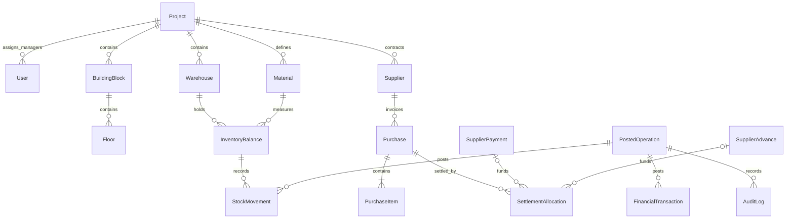

# Proposed Prisma data model

This is the Phase 0 design for `prisma/schema.prisma`, not an applied schema.
Business policy and phase ownership live in
[backend-architecture.md](backend-architecture.md); the exact transaction
algorithms, arithmetic (including cross-currency settlement, revised
2026-09-13 per [ADR 0006](adr/0006-cross-currency-settlement-explicit-rate.md)),
and the full invariant matrix live in [transaction-design.md](transaction-design.md).
Phase 1 must validate the real Prisma relations and generated SQL with the pinned
CLI; subsequent migrations add the business models as their phases arrive.

## Conventions and relationships

Use `String @db.Uuid` IDs with generated UUID defaults. Dates use
`DateTime @db.Date`; technical instants use `DateTime @db.Timestamptz(6)`. Decimal
scales are defined in architecture section 4. Project-owned parents expose
`@@unique([projectId, id])` for composite child foreign keys. Every FK uses
`onDelete: Restrict, onUpdate: Restrict` unless an explicitly documented
non-business lifecycle requires otherwise. Do not physically delete posted
business history. Master records carry `isActive`, `createdAt`, `updatedAt`.

The two funding relations on an allocation are exclusive. The diagram omits shared
project foreign keys, histories of reversals, auth, and attachment details for
readability; the tables and constraint matrix below define those relationships.

## Identity and project master data

| Model                 | Main fields                                                                                                   | Relations, uniqueness, and indexes                                                                                                                                           |
| --------------------- | ------------------------------------------------------------------------------------------------------------- | ---------------------------------------------------------------------------------------------------------------------------------------------------------------------------- |
| `Project`             | `id`, `name`, `code`, `timezone`, `isActive`, `postingSequence BigInt`, timestamps                            | Unique `code`; no cash balance. Sequence is a technical ordering/concurrency value, serialized as a string.                                                                  |
| `User`                | `id`, normalized `email`, `displayName`, `passwordHash`, `role`, nullable `projectId`, `isActive`, timestamps | Unique email; role enum `OWNER/PROJECT_MANAGER/ACCOUNTANT`; CHECK requires project iff manager; project FK restricts deletion; index `(projectId, isActive)`                 |
| `RefreshSession`      | `id`, `userId`, `createdAt`, `expiresAt`, `revokedAt`, `revocationReason`                                     | Stable login family/session ID used by JWT; user FK; indexes `(userId, revokedAt)` and `expiresAt`                                                                           |
| `RefreshToken`        | `id`, `sessionId`, unique `tokenHash`, `createdAt`, `expiresAt`, `consumedAt`, nullable unique `replacedById` | Token history within a session; self-FK to successor; no raw token. Index `(sessionId, createdAt)`; one-use transition enforced under session lock.                          |
| `BuildingBlock`       | `id`, `projectId`, `name`, `code`, master timestamps/state                                                    | Unique `(projectId, code)`; project relation                                                                                                                                 |
| `Floor`               | `id`, `projectId`, `blockId`, `label`, `sortOrder`, master timestamps/state                                   | Composite FK to block; unique `(projectId, blockId, label)` and `(projectId, blockId, id)`; index `(projectId, blockId, sortOrder)`                                          |
| `Warehouse`           | `id`, `projectId`, `name`, `code`, `comment`, master timestamps/state                                         | Unique `(projectId, code)`; project relation                                                                                                                                 |
| `Unit`                | `id`, `projectId`, `name`, `symbol`, master timestamps/state                                                  | Unique `(projectId, symbol)`; seeded project rows such as `kg`, `bag`, `m²`; no unit enum or conversion factor                                                               |
| `MaterialCategory`    | `id`, `projectId`, `name`, master timestamps/state                                                            | Unique `(projectId, name)`                                                                                                                                                   |
| `Material`            | `id`, `projectId`, `name`, `code`, `categoryId`, `unitId`, nullable `minimumStock`, master timestamps/state   | Same-project FKs to category/unit; unique `(projectId, code)`; indexes `(projectId, isActive, name)`, `(projectId, categoryId)`; unit/project immutable after first movement |
| `Supplier`            | `id`, `projectId`, `name`, `contactPerson`, `phone`, `comment`, master timestamps/state                       | Index `(projectId, isActive, name)`; no debt/advance scalar; same real-world supplier in two projects has separate IDs                                                       |
| `TransactionCategory` | `id`, `projectId`, `name`, `kind`, master timestamps/state                                                    | Unique `(projectId, kind, name)`; kinds `INCOME/EXPENSE`; verify kind against posting; historical name snapshot on finance                                                   |

Normalizing email is explicit; case-insensitive application comparisons alone do
not replace the unique normalized stored key. Disabling a user/project is checked
on reads, writes, and token rotation. References to archived master records remain
valid for history and guarded corrections, while new postings require active rows.
Master identity/code reuse is forbidden in MVP even after archival.

## Operations, cash, and currency

`PostedOperation` is a correlation and idempotency record for one transaction. It
does not dispatch workflows or replace typed business tables. Finances, purchases,
supplier operations, and inventory headers relate to it by same-project FK.

| Model                  | Main fields                                                                                                                                                                                                                                                                               | Relations, uniqueness, and indexes                                                                                                                                                                             |
| ---------------------- | ----------------------------------------------------------------------------------------------------------------------------------------------------------------------------------------------------------------------------------------------------------------------------------------- | -------------------------------------------------------------------------------------------------------------------------------------------------------------------------------------------------------------- |
| `PostedOperation`      | `id`, `projectId`, `actorId`, `kind`, `idempotencyKey`, `requestHash`, `occurredOn`, `postedAt`, `sequence`, nullable `cancelledAt`, `cancellationReason`, nullable `reversalOfId`, `replacementOfId`                                                                                     | Unique `(projectId, actorId, kind, idempotencyKey)`, `(projectId, sequence)`, and `reversalOfId`; same-project self-FKs; actor FK; index `(projectId, occurredOn, id)`                                         |
| `FinancialTransaction` | `id`, `projectId`, `operationId`, `type`, `direction`, `amount`, `currency`, `exchangeRate`, `amountUzs`, `rateSource`, optional `rateId`, `rateOverrideReason`, `categoryId`, `categoryNameSnapshot`, `recipient`, `comment`, optional `supplierPaymentId`, `reversalOfId`, `refundOfId` | Business types `INCOME/EXPENSE/PURCHASE/SALARY/ADVANCE/DEBT_PAYMENT/REFUND/ADJUSTMENT`; direction `IN/OUT`; positive amounts; unique reversal link; same-project FKs; immutable monetary/classification fields |
| `CurrencyRate`         | `id`, `projectId`, `currency`, `rateUzs`, `effectiveOn`, `recordedAt`, `source`, `providerReference`, `createdById`, `overrideReason`                                                                                                                                                     | Append-only quotes; index `(projectId, currency, effectiveOn, recordedAt)`; no uniqueness by day because separate quotes/overrides may coexist                                                                 |

Operation kinds identify concrete workflows, including opening cash/stock,
standalone finance, purchase, supplier payment/advance, write-off, transfer and
cancellation. Reversal operation ID is unique per original; a deferred constraint
checks that `cancelledAt` and the reverse relation agree. For idempotency, resolve
the result through the typed header/financial relation to the operation ID, rather
than saving a mutable untyped resource ID or replaying an obsolete response body.

Finance reporting joins operation dates/sequence, using indexes on
`(projectId, operationId)`, `(projectId, type)`, `(projectId, categoryId)`,
`(projectId, currency)` and the operation date index. Add index support for the
actual aggregate plans after EXPLAIN; do not assume all multi-table filters can be
satisfied by one large index. Refund links are indexed and may have multiple
partial refunds; cumulative bounds are checked inside the project transaction.

For originals, income/refund are IN; expenses, purchase cash, salary, advance
funding, and debt payment are OUT. Opening adjustment allows an explicit direction
and reason. A reversal keeps the original type with the opposite direction.
Purchase-related cash may only be inserted by its owning purchase/supplier workflow.
At most one financial row per supplier payment in an operation is enforced by a
unique `(operationId, supplierPaymentId)` key; a deferred check requires exactly one
for a positive payment, with matching currency, values and expected type.

## Purchases and supplier settlements

All following rows carry `projectId`. Give purchases, supplier payments, and
advances a compound unique key `(projectId, supplierId, id)`; allocations
reference each of them through that key, which enforces same-project/same-supplier
agreement in the database. This compound key deliberately does not include
`currency` — a settlement allocation may legitimately link a purchase and a
funding source (payment or advance) denominated in different currencies (see
[ADR 0006](adr/0006-cross-currency-settlement-explicit-rate.md) and
[transaction-design.md §5](transaction-design.md#5-settlement-allocation-cross-currency-settlement)).
Each of `Purchase.currency`, `SupplierPayment.currency`, and
`SupplierAdvance.currency` remains its own entity's fixed, immutable currency;
only the allocation connecting them performs any conversion.

| Model                  | Main fields                                                                                                                                                                                                                                                                                            | Relations, uniqueness, and indexes                                                                                                                                                                                                                                                                                                                                                                                                                                                                                                                                   |
| ---------------------- | ------------------------------------------------------------------------------------------------------------------------------------------------------------------------------------------------------------------------------------------------------------------------------------------------------ | -------------------------------------------------------------------------------------------------------------------------------------------------------------------------------------------------------------------------------------------------------------------------------------------------------------------------------------------------------------------------------------------------------------------------------------------------------------------------------------------------------------------------------------------------------------------- |
| `Purchase`             | `id`, `operationId`, `supplierId`, `warehouseId`, `currency`, `exchangeRate`, `totalAmount`, `totalAmountUzs`, rate provenance fields, nullable `invoiceNumber`, `comment`, supplier/warehouse label snapshots                                                                                         | Unique `operationId`; same-project supplier/warehouse/operation FKs; unique `(projectId, supplierId, id)` for allocation references; indexes `(projectId, supplierId)`, `(projectId, warehouseId)`; invoice number is searchable, not assumed globally unique                                                                                                                                                                                                                                                                                                        |
| `PurchaseItem`         | `id`, `purchaseId`, `lineNumber`, `materialId`, `quantity`, `unitPrice`, `lineAmount`, `lineAmountUzs`, material/unit name snapshots                                                                                                                                                                   | Same-project purchase/material FKs; unique `(purchaseId, lineNumber)` and `(purchaseId, materialId)`; index `(projectId, materialId)`                                                                                                                                                                                                                                                                                                                                                                                                                                |
| `SupplierPayment`      | `id`, `operationId`, `supplierId`, `purpose`, `currency`, `amount`, `exchangeRate`, `amountUzs`, rate provenance fields, `comment`                                                                                                                                                                     | Purpose `PURCHASE_CASH/DEBT_PAYMENT/ADVANCE_FUNDING`; unique `operationId`; unique `(projectId, supplierId, id)`; index `(projectId, supplierId, currency)`                                                                                                                                                                                                                                                                                                                                                                                                          |
| `SupplierAdvance`      | `id`, `supplierId`, `fundingPaymentId`, `currency`, `fundedAmount`, `fundedAmountUzs`                                                                                                                                                                                                                  | Unique funding payment; unique `(projectId, supplierId, id)`; immutable funding snapshot must match advance-funding payment; index `(projectId, supplierId, currency)`                                                                                                                                                                                                                                                                                                                                                                                               |
| `SettlementAllocation` | `id`, `operationId`, `supplierId`, `purchaseId`, nullable `fundingPaymentId`, nullable `advanceId`, `settlementCurrency`, `settlementAmount`, `settlementValueUzs`, `debtCurrency`, nullable `settlementExchangeRate`, `debtAmountSettled`, `exchangeDifferenceUzs`, `effect`, nullable `reversalOfId` | XOR funding source (exactly one of `fundingPaymentId`, `advanceId`); `effect APPLY/REVERSE`; unique reversal; compound FKs `(projectId, supplierId, purchaseId)` and `(projectId, supplierId, fundingPaymentId)` / `(projectId, supplierId, advanceId)` — same supplier/project required, currencies independent; CHECK `(settlementExchangeRate IS NULL) = (debtCurrency = 'UZS' OR debtCurrency = settlementCurrency)` and `settlementExchangeRate > 0` when present; indexes `(projectId, purchaseId)`, `(projectId, advanceId)`, `(projectId, fundingPaymentId)` |

Purchase total, debt, and advance are distinct quantities. There is no
`Supplier.debt`, `Supplier.advance`, editable `Purchase.paidAmount`, or ledger row
for an unpaid invoice. Current debt (in `debtCurrency`, i.e. the purchase's own
currency) is the purchase's `totalAmount` less the sum of effective
`debtAmountSettled` values. Current available advance (in the advance's own
`currency`) is `fundedAmount` less the sum of effective `settlementAmount` values
consuming it. Historical queries use dated original and reversal operations
instead of current status alone.

An immediate purchase payment shares the purchase operation, links one finance row
and one allocation, and cannot be independently cancelled. A later debt payment
has its own operation and explicit allocations to one or more purchases. Its
allocations' `settlementAmount` values total exactly its nominal payment amount;
no unused payment remainder is silently converted into an advance. Funding an
advance creates a payment, advance lot, finance row and audit, without a purchase
allocation. Consuming the advance creates only an allocation. Currency and rate
snapshots on `Purchase`/`SupplierPayment`/`SupplierAdvance` cannot be edited
later; a `SettlementAllocation`'s own `settlementExchangeRate` (when present) is
likewise immutable once posted.

An allocation reversal uses the same purchase and funding references as its
original and copies all numeric values (`settlementAmount`, `settlementValueUzs`,
`debtAmountSettled`, `settlementExchangeRate`, `exchangeDifferenceUzs`), with
reverse effect. Reversing payment or advance funding uses a reversal operation and
opposite cash row referencing the original supplier payment; no second positive
funding record is created.

## Inventory history and projection

| Model               | Main fields                                                                                                                                                                                                                                                                                                     | Relations, uniqueness, and indexes                                                                                                                                                                                                             |
| ------------------- | --------------------------------------------------------------------------------------------------------------------------------------------------------------------------------------------------------------------------------------------------------------------------------------------------------------- | ---------------------------------------------------------------------------------------------------------------------------------------------------------------------------------------------------------------------------------------------- |
| `InventoryBalance`  | `id`, `projectId`, `warehouseId`, `materialId`, `quantity`, `valueUzs`, `version BigInt`, nullable `effectiveHeadId`                                                                                                                                                                                            | Unique `(warehouseId, materialId)`; same-project warehouse/material FKs; composite unique `(projectId, warehouseId, materialId, id)`; same-balance head FK; index `(projectId, warehouseId)`                                                   |
| `StockMovement`     | `id`, `projectId`, `operationId`, `balanceId`, `warehouseId`, `materialId`, `kind`, `quantityDelta`, `valueDeltaUzs`, `unitCostUzs`, `quantityBefore`, `valueBeforeUzs`, `quantityAfter`, `valueAfterUzs`, nullable `previousEffectiveMovementId`, `reversalOfId`, `purchaseItemId`, `writeOffId`, `transferId` | Immutable; kind `OPENING_RECEIPT/PURCHASE_RECEIPT/WRITE_OFF/TRANSFER_OUT/TRANSFER_IN/REVERSAL`; same-project source FKs; unique reversal and `(operationId, warehouseId, materialId)`; composite same-balance keys for history/head references |
| `StockWriteOff`     | `id`, `projectId`, `operationId`, `warehouseId`, `materialId`, `blockId`, `floorId`, `quantity`, `unitCostUzs`, `totalCostUzs`, `comment`, material/unit/block/floor label snapshots                                                                                                                            | Unique operation; composite floor FK `(projectId, blockId, floorId)`; same-project warehouse/material; indexes `(projectId, blockId)`, `(projectId, floorId)`                                                                                  |
| `WarehouseTransfer` | `id`, `projectId`, `operationId`, `sourceWarehouseId`, `destinationWarehouseId`, `materialId`, `quantity`, `unitCostUzs`, `totalCostUzs`, `comment`                                                                                                                                                             | Unique operation; same-project warehouse/material FKs; source differs from destination; indexes `(projectId, sourceWarehouseId)`, `(projectId, destinationWarehouseId)`                                                                        |

Movement history has indexes `(projectId, warehouseId, materialId, operationId)`,
`(projectId, operationId)`, `purchaseItemId`, `writeOffId` and `transferId`. Operation
dates support date filtering. Head and previous-head relations must reference a
movement for the same project/warehouse/material, not just an arbitrary movement ID.
Every source link also agrees with the material/location recorded in its header.

Create a zero balance with a null head before inserting its first movement; then
set the head inside the same transaction. Nullable heads resolve the initial
relation cycle. Rows remain at zero rather than being deleted. A reversal movement
references the original header/item and original movement, so queries can follow
both directions. The unique operation/balance key allows one original movement
per balance per operation; purchase duplicate material lines are rejected and
transfer endpoints must differ.

Store authoritative quantity and value, deriving weighted average on read;
there is no independently mutable average-cost column. Snapshot columns are
deliberate historical evidence for exact guarded cancellation. They are not
permission to restore a stale snapshot without checking the effective head.

## Audit and files

| Model        | Main fields                                                                                                                                                                                                                                                    | Relations, uniqueness, and indexes                                                                                                                                                                                                       |
| ------------ | -------------------------------------------------------------------------------------------------------------------------------------------------------------------------------------------------------------------------------------------------------------- | ---------------------------------------------------------------------------------------------------------------------------------------------------------------------------------------------------------------------------------------- |
| `AuditLog`   | `id`, nullable `projectId`, nullable `actorId`, `actorKind`, nullable `operatorIdentity`, `action`, `entityType`, `entityId`, nullable `operationId`, `requestId`, nullable `previousData Json`, `newData Json`, `createdAt`                                   | Immutable; project/user/operation FKs where applicable; actor kind USER requires actor ID, OPERATOR requires explicit operator identity; index `(projectId, createdAt, id)`, `(projectId, entityType, entityId)`, `(actorId, createdAt)` |
| `Attachment` | `id`, `projectId`, `uploadedById`, `storageProvider`, unique `storageKey`, `originalName`, `mimeType`, `sizeBytes`, `checksum`, `status`, `expiresAt`, nullable `financialTransactionId`, `purchaseId`, `supplierPaymentId`, timestamps, nullable `unlinkedAt` | Same-project target FKs; USER FK; one target required for LINKED, at most one during staging; indexes `(projectId, createdAt)`, each target FK, `(status, expiresAt)`                                                                    |

Global audit rows are limited to auth/operator account events and are not returned
by project audit endpoints. A generic audit entity ID is descriptive history, not
a business foreign reference or a source of authorization. Actual business sources
use typed foreign keys. Logs never contain password hashes, refresh-token hashes,
access tokens, storage secrets, or signed links.

Use attachment states `PENDING/READY/LINKED/FAILED/UNLINKED`. Unlinking is audited
and preserves original target information; historical linked files are retained.
Orphan cleanup only removes expired, never-linked staging objects. A cleanup worker
and finalizer claim/recheck state under the project/attachment locking protocol;
deletion occurs outside SQL transactions and a claimed-for-cleanup object cannot
be finalized. A separate terminal `EXPIRED` state can represent that claim and is
not reversible to LINKED. Storage deletion is idempotent and retried after failure.

## Constraint and migration acceptance matrix

Prisma represents composite relations, keys, and indexes. Named SQL constraints,
privileges, and triggers that Prisma cannot express belong in reviewed migration
SQL, not runtime schema synchronization. See the
[primary-source research](research/transaction-design.md) for their capabilities
and limits.

| Invariant                                         | Database enforcement                                                                                                                                                       | Transaction/workflow enforcement                                                                                               |
| ------------------------------------------------- | -------------------------------------------------------------------------------------------------------------------------------------------------------------------------- | ------------------------------------------------------------------------------------------------------------------------------ |
| Manager belongs to exactly one project            | CHECK `(role = 'PROJECT_MANAGER' AND projectId IS NOT NULL) OR (role <> 'PROJECT_MANAGER' AND projectId IS NULL)`                                                          | Current role/session/project authorization on each call                                                                        |
| Same-project references                           | Composite FKs and parent unique keys                                                                                                                                       | Batch validation for safe application errors                                                                                   |
| Same supplier on allocations (currency may cross) | Compound FK `(projectId, supplierId, purchaseId)` and `(projectId, supplierId, fundingPaymentId or advanceId)`                                                             | Compute `debtAmountSettled` per transaction-design.md §5; reject a missing/non-positive `settlementExchangeRate` when required |
| Cross-currency settlement rate explicit           | CHECK `(settlementExchangeRate IS NULL) = (debtCurrency = 'UZS' OR debtCurrency = settlementCurrency)`, `settlementExchangeRate > 0` when present                          | `409 SETTLEMENT_RATE_REQUIRED` before any write when the rate is required but missing                                          |
| Correct floor/block                               | Composite FK `(projectId, blockId, floorId)`                                                                                                                               | Require active floor and block in write-off                                                                                    |
| Amount/rate validity                              | NOT NULL + positive/range/finite checks; UZS rate=1; `amountUzs = round(amount * rate, 2)` for cash/whole invoices                                                         | Reject excessive input scale before SQL coercion; compute item rounding allocation explicitly                                  |
| Positive quantity and stock conservation          | CHECK balances/snapshots nonnegative, `quantity = 0 => valueUzs = 0`, movement after = before + delta; kind-specific delta signs                                           | Project lock, costing, and effective-head verification                                                                         |
| Paired transfer and header consistency            | Deferred constraint trigger: exactly two original legs, correct endpoints/material, opposite quantity/value, each matches header; equivalent inverse legs for cancellation | One workflow transaction; no raw movement API                                                                                  |
| Inventory projection reconciles                   | Deferred trigger checks touched balance against signed movement sum and valid effective head; movement/header FKs                                                          | Writer increments version, uses current snapshot, and never updates immutable history                                          |
| Invoice items and receipt completeness            | Deferred trigger validates item sum, invoice UZS sum, one matching original receipt per item; reversal completeness on cancellation                                        | DTO items and calculated totals; one transaction                                                                               |
| Debt and advance limits                           | Row-local allocation positivity, funding XOR, unique reversal, FKs; deferred final-state aggregate bounds on touched purchases/funding lots/payments                       | Project lock for all posting/reversal paths; partial/final allocation residue calculations                                     |
| Reversal accuracy                                 | Unique same-project reversal FK, original cannot itself be reversal; deferred equality of copied fields/opposite signs; cancelled state agrees with reversal               | Named owning cancellation workflow and dependency checks                                                                       |
| Append-only history                               | Application role denied DELETE; trigger prevents changes to posted monetary/history fields; only explicitly allowed comment/status changes survive with audit              | No hard-delete endpoint, audited metadata edits, restricted operator tooling                                                   |
| Required audit                                    | Deferred operation constraint requires matching actor/project/action audit at commit                                                                                       | Audit writer receives transaction client and failure aborts operation                                                          |
| Attachment target cardinality                     | CHECK target count/state; project-qualified target FKs                                                                                                                     | Verify supported target kind, object content/existence, current authorization                                                  |

Deferred functions must cover INSERT and every permitted relevant UPDATE on both
parent and child sides. Migration review must check SQL three-valued/null behavior
and all reversal paths. Deferrable checks do not coordinate concurrency by
themselves; the project lock and serializable retry protocol still applies.
Reconciling touched balances by indexed history aggregation is a deliberate initial
cost. Measure it with long histories; optimize using verified local transition
checks plus scheduled full reconciliation only if equivalent correctness is proved.

For every schema-changing phase: run Prisma format/validate/generate, inspect the
generated migration, add named SQL-only rules, apply all migrations to a clean
PostgreSQL test database, and run negative constraint tests as well as workflow
tests. Verify runtime-role permissions separately from migration-role permissions.
Never use `db push` as the production migration workflow or assume a Prisma schema
alone contains every invariant. Test rollback and complete cancellation under the
real migration/trigger definitions; do not leave trigger design as unchecked prose
once its owning implementation phase is declared complete.
